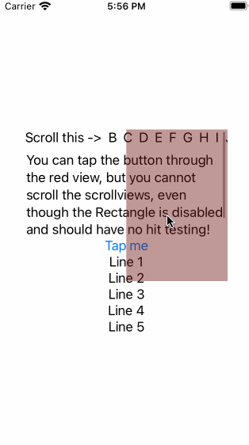

# Expected behavior

Element with `.allowsHitTesting(false).disabled(true)` should not swallow any user interactions.

# Actual behavior

Clicks at buttons might happen through the element, but all gestures are swallowed - user cannot scroll the underlying ScrollViews if the origin of touch begins in a red overlay rectangle.

# Where it happens

Everywhere I tried - iOS, WatchOS ...

# Video:

# Workaround

See branch `hacky-workaround-01` with a hack from https://stackoverflow.com/a/68448681/38729.

It works, but I have no idea about performance implications, and (main problem for me!) **it isn't applicable in WatchOS**.

# Other cases where people encountered this

- https://stackoverflow.com/questions/63749022/how-can-i-tap-the-toggle-under-a-view-in-swiftui/63750285#63750285
- https://stackoverflow.com/questions/65468295/swiftui-solution-to-disable-hit-testing
- https://stackoverflow.com/questions/59493480/swiftui-scrollview-stops-working-in-zstack-under-rectangle-with-gradient